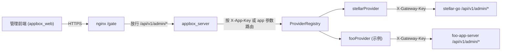
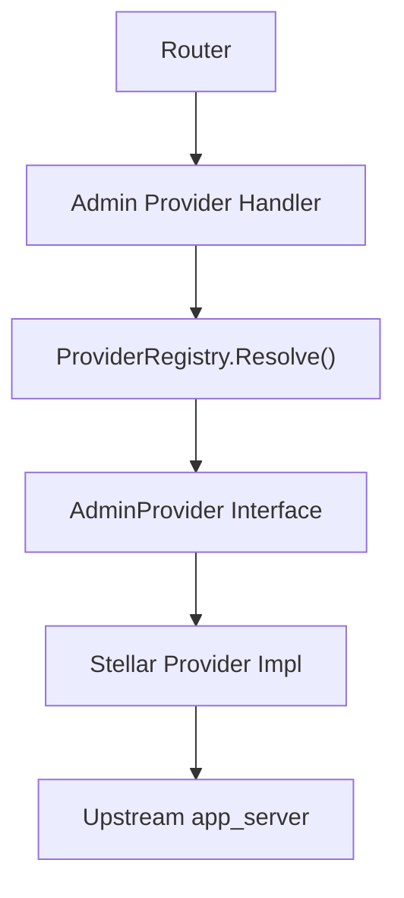
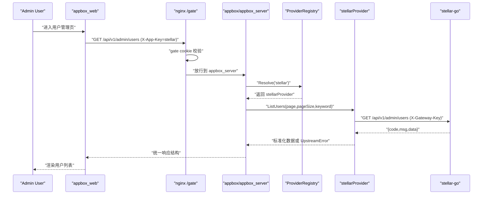

# appbox/appbox_server 网关架构设计

## 1. 目标与定位

`appbox/appbox_server` 是多应用后台管理网关，职责是：

- 对管理前端提供统一 API 入口
- 将管理请求按 app/provider 路由到对应 `app_server`
- 屏蔽各 `app_server` 的差异（地址、鉴权头、错误格式）
- 复用 nginx `/gate` 提供统一访问口令校验

它不是业务主服务，不直接持有各 app 的业务数据。

## 2. 分层结构

当前代码分层如下：

- 启动与装配层：`/Users/darrenyou/VscodeProjects/appbox/template_server/cmd/server/main.go`
- 路由层：`/Users/darrenyou/VscodeProjects/appbox/template_server/internal/api/router/router.go`
- 处理器层：`/Users/darrenyou/VscodeProjects/appbox/template_server/internal/api/handler`
- provider 抽象与注册中心：`/Users/darrenyou/VscodeProjects/appbox/template_server/internal/service/provider.go`
- provider 实现（示例：stellar）：`/Users/darrenyou/VscodeProjects/appbox/template_server/internal/service/stellar_provider.go`
- DTO 与响应协议：`/Users/darrenyou/VscodeProjects/appbox/template_server/internal/dto`
- 配置层：`/Users/darrenyou/VscodeProjects/appbox/template_server/internal/config/config.go`

### 2.1 总体架构图

### 2.2 网关内部组件关系

## 3. 核心设计

### 3.1 统一入口与访问控制

- 管理前端访问先经过 nginx `/gate/`
- nginx 通过 `auth_request` + cookie 保护 `/`、静态资源和 `/api/`
- `appbox_server` 只暴露统一管理接口，不再处理登录或 JWT

这保证了前端只对接一套访问控制入口，同时避免在 `appbox_server` 内重复维护登录状态。

### 3.2 Provider 路由机制

网关内部定义统一接口 `AdminProvider`，每个 app 实现一套 provider：

- `ListUsers`
- `ListUserPlanets`
- `UpdateUser`
- `DeleteUser`
- `ListConfigs`
- `UpsertConfig`
- `DeleteConfig`

请求路由规则：

1. 优先读取请求头 `X-App-Key`
2. 若无则读取 query `app`
3. 都没有则使用 `DEFAULT_APP_PROVIDER`

这样可以在同一套 API 下支持多 app 切换。

### 3.3 与 app_server 的调用模型

网关到 `app_server` 走服务间调用：

- 网关发起 HTTP 请求
- 携带服务鉴权头（示例：`X-Gateway-Key`）
- 解析 `app_server` 统一响应结构并回传给前端

这层由 provider 承担，路由与 handler 不感知上游细节。

### 3.4 统一错误语义

- 上游返回 4xx/5xx 或业务非 200 时，封装为 `UpstreamError`
- handler 根据 `UpstreamError.StatusCode` 原样映射或降级为 `502`
- 前端感知为统一 `code/msg` 结构

## 4. 请求链路

### 4.1 Gate 登录链路

1. 用户访问 `appbox.xdarren.com`
2. nginx 对未授权请求重定向到 `/gate/`
3. `/gate/api/login` 校验访问口令并写入 gate cookie
4. 前端回跳到原始目标路径

### 4.2 管理操作链路（跨 app）

1. 前端调用 `/api/v1/admin/*`
2. nginx gate 放行后，请求进入 `appbox_server`
3. 网关解析 provider key
4. `ProviderRegistry` 解析具体 provider
5. provider 调用目标 `app_server`（带网关密钥）
6. 网关返回统一响应

### 4.3 管理请求交互时序图（以查询用户为例）

## 5. 当前已接入 provider

- `stellar`（星烁）

配置项：

- `provider.stellar.name`
- `provider.stellar.base_url`
- `provider.stellar.gateway_header`
- `provider.stellar.gateway_key`
- `provider.stellar.timeout`

参考：`/Users/darrenyou/Projects/appbox/template_server/config/config.yaml`

## 6. 扩展策略

新增一个 app 时，不改前端主流程，只需：

1. 新增 provider 配置项
2. 实现新的 `AdminProvider`
3. 在 `main.go` 注册 provider
4. 在文档中补充 provider key 与运维配置

## 7. 安全边界

- 前端到 nginx：gate cookie（访问口令）
- 网关到 app_server：服务间密钥（`X-Gateway-Key`）
- 网关是唯一对前端开放的管理入口，`app_server` 管理接口应限制仅网关访问
