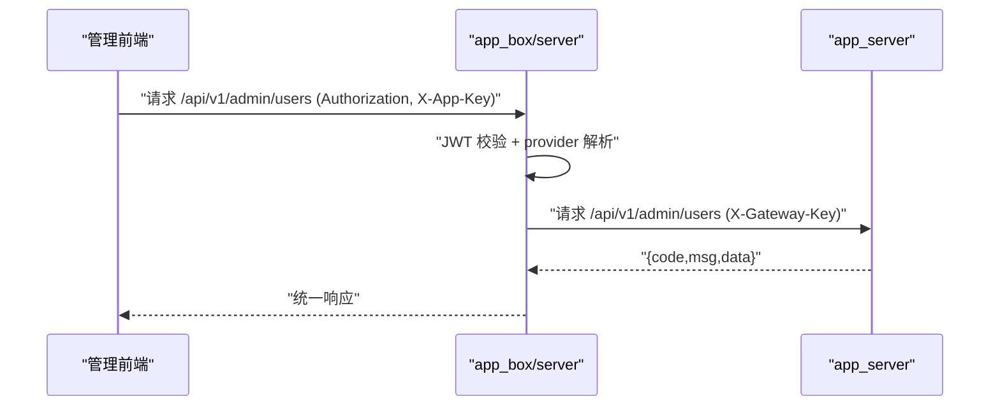
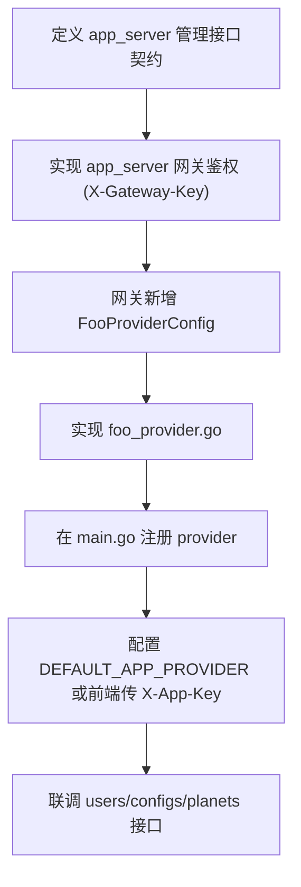
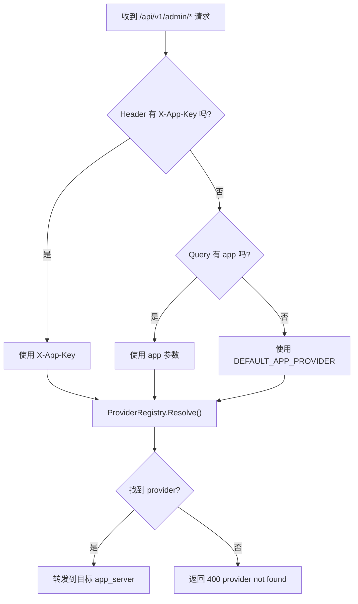
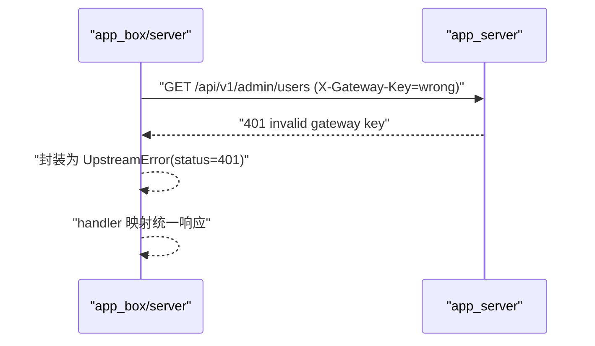

# app_server 对接网关指南

本文档说明业务服务（`app_server`）如何接入 `app_box/server` 网关。

## 1. 对接目标

接入后效果：

- 前端仍只调用网关：`/api/v1/admin/*`
- 网关根据 `X-App-Key` 或默认 provider 转发到目标 `app_server`
- `app_server` 只暴露管理能力接口，不负责管理端登录

## 1.1 运行期交互图



## 2. app_server 必须满足的契约

## 2.1 接口前缀

建议统一前缀：`/api/v1/admin`

## 2.2 管理能力接口

至少实现以下接口（与网关 `AdminProvider` 对齐）：

- `GET /admin/users`
- `GET /admin/users/:id/planets`
- `PUT /admin/users/:id`
- `DELETE /admin/users/:id`
- `GET /admin/configs`
- `PUT /admin/configs/:key`
- `DELETE /admin/configs/:key`

## 2.3 服务间鉴权

`app_server` 必须在 `/admin/*` 上启用网关鉴权中间件，例如：

- Header 名：`X-Gateway-Key`
- 值：由网关与 `app_server` 约定

建议返回：

- 缺少 key：`401`
- key 错误：`401`
- 未配置服务端 key：`503`

## 2.4 统一响应结构

网关按如下结构解析上游：

```json
{
  "code": 200,
  "timestamp": 1739332800000,
  "msg": "success",
  "data": {}
}
```

要求：

- HTTP 2xx + `code=200` 视为成功
- 其他情况视为失败并由网关透传/映射

## 3. 网关侧接入步骤

以下步骤以新增 `foo` app 为例。

## 3.1 接入流程图



### 步骤 1：扩展配置

在 `internal/config/config.go` 中新增 `FooProviderConfig`，至少包含：

- `Enabled`
- `Name`
- `BaseURL`
- `GatewayHead`
- `GatewayKey`
- `Timeout`

并在 `.env.example` 新增对应环境变量。

### 步骤 2：实现 Provider

新增文件示例：

- `internal/service/foo_provider.go`

实现 `AdminProvider` 接口，建议复用 `stellar_provider.go` 的实现方式：

- 统一 `doJSON`
- 统一错误封装为 `UpstreamError`
- 支持 query/path 参数编码与 DTO 映射

### 步骤 3：注册 Provider

在 `cmd/server/main.go` 中注册：

```go
if cfg.Provider.Foo.Enabled {
    fooProvider := service.NewFooProvider(cfg.Provider.Foo)
    registry.Register(fooProvider.Name(), fooProvider)
}
```

### 步骤 4：选择默认 Provider（可选）

设置：

- `DEFAULT_APP_PROVIDER=foo`

若不设置，前端可通过 `X-App-Key: foo` 精确指定。

## 3.2 provider 选择逻辑图



## 4. 前端调用约定

前端调用网关无需关心具体 app 地址，仅需：

- 携带网关 JWT（`Authorization`）
- 通过以下任一方式指定 app：
  - Header：`X-App-Key: <provider_name>`
  - Query：`?app=<provider_name>`

如果两者都缺省，网关使用 `DEFAULT_APP_PROVIDER`。

## 5. 以 stellar 为参考实现

当前 `stellar` 已是完整样例：

- provider 实现：`/Users/darrenyou/VscodeProjects/app_box/server/internal/service/stellar_provider.go`
- provider 配置：`/Users/darrenyou/VscodeProjects/app_box/server/internal/config/config.go`
- 示例环境变量：`/Users/darrenyou/VscodeProjects/app_box/server/.env.example`

## 6. 联调检查清单

1. 网关配置了目标 app 的 `BaseURL`、`GatewayKey`。
2. `app_server` 的 `/admin/*` 已开启网关鉴权。
3. 网关调用 `GET /api/v1/admin/providers` 能看到目标 provider。
4. 使用 `X-App-Key` 调用 `GET /api/v1/admin/users` 返回正确数据。
5. 错误 key 时，网关可收到并返回 401 错误语义。

## 7. 常见问题

- `provider not found`：未注册 provider 或 `X-App-Key` 与 `Name` 不一致。
- `502`：`app_server` 不可达、响应非 JSON 或响应结构不符合契约。
- `401 invalid gateway key`：网关与 `app_server` 的 key 不一致。
- `503 gateway auth key is not configured`：`app_server` 未配置鉴权 key。

## 7.1 网关与 app_server 鉴权失败时序图


