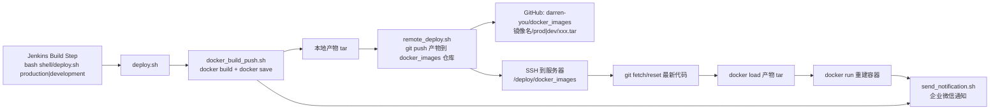

# shell 部署脚本说明

本目录把 `build -> deploy -> notification` 拆成可复用脚本，Jenkins 只需要执行 `deploy.sh`。
当前流程为：本地构建镜像并导出 tar -> 上传到 Git 制品仓库 -> SSH 到服务器 `git pull` 最新制品并 `docker load + run` -> 发送通知。
固定参数（Git 仓库、服务器 SSH、容器参数、Webhook）统一写死在 `config.sh`。

## 设计架构图



制品路径规则：
- 仓库内路径：`<镜像名>/<prod|dev>/<镜像名>_<prod|dev>_<short_sha>_<yyyymmddHHMMSS>.tar`
- 示例：`app-box-server/prod/app-box-server_prod_bf4d19c_20260212142852.tar`
- 每次上传会清理同环境旧 tar，只保留最新一个产物。
- 服务器拉取仓库存放路径：`REMOTE_ARTIFACT_REPO_DIR`（默认 `/deploy/docker_images`）

## 脚本清单

- `config.sh`：项目配置与默认值（复制到新项目时优先改这个文件）
- `common.sh`：公共函数
- `docker_build_push.sh`：构建并导出 Docker 镜像 tar
- `remote_deploy.sh`：先上传 tar 到 Git 制品仓库，再 SSH 到服务器拉取并重启容器
- `send_notification.sh`：发送企业微信通知
- `deploy.sh`：总控脚本（Jenkins Build Steps 只调用它）

## Jenkins 使用方式

1. 先在 `config.sh` 填好固定配置：
   - `ARTIFACT_GIT_REPO`（例如 `git@github.com:darren-you/docker_images.git`）
   - `DEPLOY_HOST`、`DEPLOY_PORT`、`DEPLOY_USER`
   - `DEPLOY_SSH_PASSWORD` 或 `DEPLOY_SSH_KEY_PATH`
   - `REMOTE_ARTIFACT_REPO_DIR`
   - `PROD_CONTAINER_NAME`、`PROD_HOST_PORT`（和 development 对应配置）
   - `WECHAT_WEBHOOK_URL`
2. Jenkins Build Steps 只传一个参数 `BUILD_ENV`：

```bash
bash shell/deploy.sh production
```

或：

```bash
bash shell/deploy.sh development
```

## 本地调试

仅构建并打包：

```bash
BUILD_ENV=production bash shell/docker_build_push.sh
```

仅执行上传 + 远端部署（依赖已有 metadata）：

```bash
META_FILE=/tmp/app.meta bash shell/remote_deploy.sh --metadata-file /tmp/app.meta
```

完整流程：

```bash
bash shell/deploy.sh production
```
